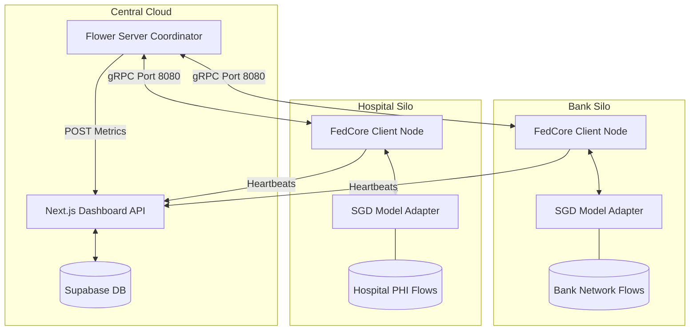

# CyberFed AI System Architecture

This document describes the high-level system architecture of the CyberFed AI platform, focusing on the decoupling between the generic Federated Learning platform layer (**FedCore**) and the domain-specific cybersecurity implementation layer (**FedSOC**).

---

## 1. Architectural Model Overview

The system is designed with a two-layer structure to separate concern areas:

```
┌────────────────────────────────────────────────────────┐
│               FedSOC Cybersecurity App                 │
│  (SGD/XGBoost Adapters, Preprocessors, Threat Alerts)   │
└───────────────────────────┬────────────────────────────┘
                            │ (Inherits/Implements)
┌───────────────────────────▼────────────────────────────┐
│                  FedCore FL Platform                   │
│   (Flower Servers/Clients, FedAvg Strategy, Checkpoint)│
└────────────────────────────────────────────────────────┘
```

1.  **FedCore Platform Layer**: Provides domain-agnostic federated aggregation, client registry, checkpointing, and gRPC communication modules.
2.  **FedSOC Application Layer**: Provides the datasets, loaders, preprocessors, classifiers, and evaluation metrics specific to cybersecurity network flow data.

---

## 2. Component Layout

### 2.1 FedCore Components
- **`BaseModel`**: The abstract model adapter interface. Defines hooks for `get_parameters()`, `set_parameters()`, `fit()`, `evaluate()`, and `predict()`. Decoupled from all domain packages.
- **`FedCoreServer`**: Integrates Flower's Server Coordinator. Controls training rounds, starts/stops gRPC listeners, and manages strategies.
- **`FedCoreClient`**: Implements Flower's `NumPyClient`. Intercepts incoming global parameters, runs local training, and performs security auditing.
- **`FedCoreStrategy`**: Extends Flower's `FedAvg` to capture custom fit/evaluation metrics and report round progress to Next.js API.
- **`CheckpointManager`**: Handles saving round checkpoints (`.pkl` weights dicts) and metric logs.
- **`ClientRegistry`**: Manages client connection heartbeats.

### 2.2 FedSOC Components
- **`SGDClassifierModel` / `XGBoostClassifierModel`**: Concrete models subclassing `BaseModel`.
- **`CICIDS2017Preprocessor`**: Handles flow cleanses, null imputations, and normalization.
- **`LocalTrainer`**: Orchestrates loading local splits and saving artifact files.
- **`SecurityAuditor`**: Ensures no raw packet payloads, strings, or features leave client nodes.

---

## 3. Communication & Topology

The network consists of a central coordinator (SuperLink) and multiple decentralized organizational clients (silos).



---

## 4. Design Guidelines

- **Zero Cybersecurity Logic in FedCore**: Do not import or write security-specific variables, features, or metrics inside `fedcore/`.
- **BaseModel Conformity**: Any new model type (TensorFlow, PyTorch, LightGBM) must subclass `BaseModel` to plug into the FedCore platform.
