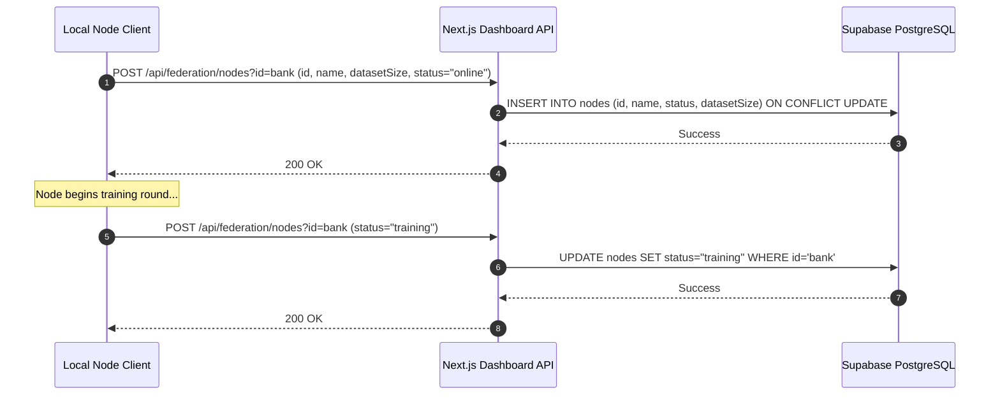
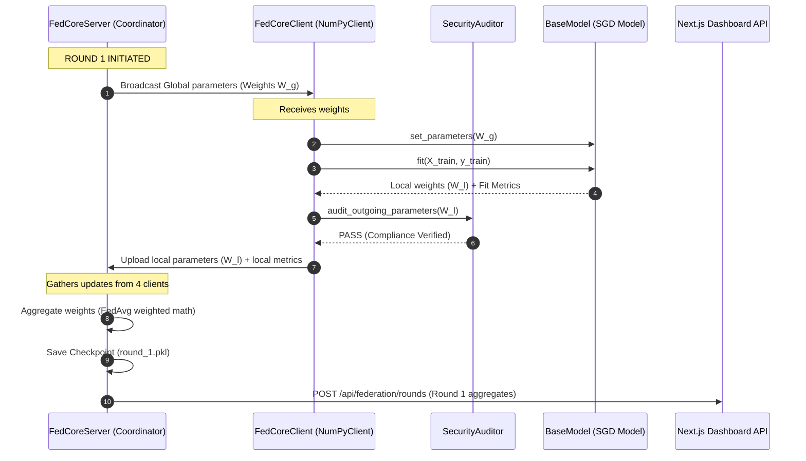

# Sequence Diagrams

This document contains sequence diagrams explaining core system events inside the CyberFed AI platform.

---

## 1. Client Node Registration & Heartbeat Loop

This flow describes how remote clients announce their state to the central Next.js dashboard API:

---

## 2. Federated Training Round

This flow describes a single round of federated weights broadcast, local fitting, parameter aggregation, and checkpointing:

