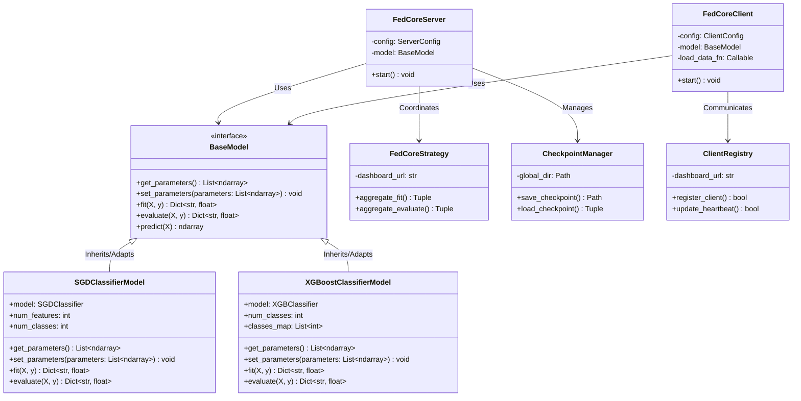
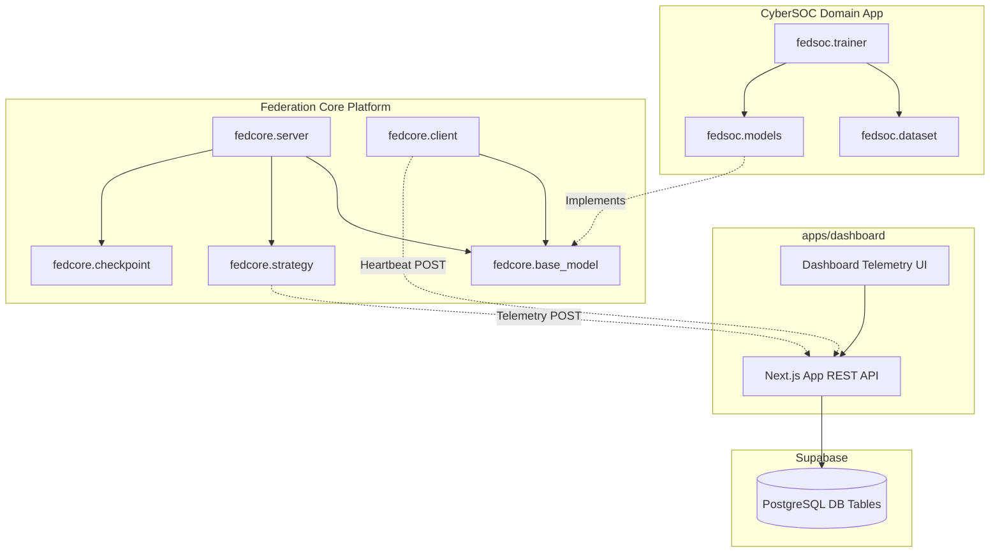
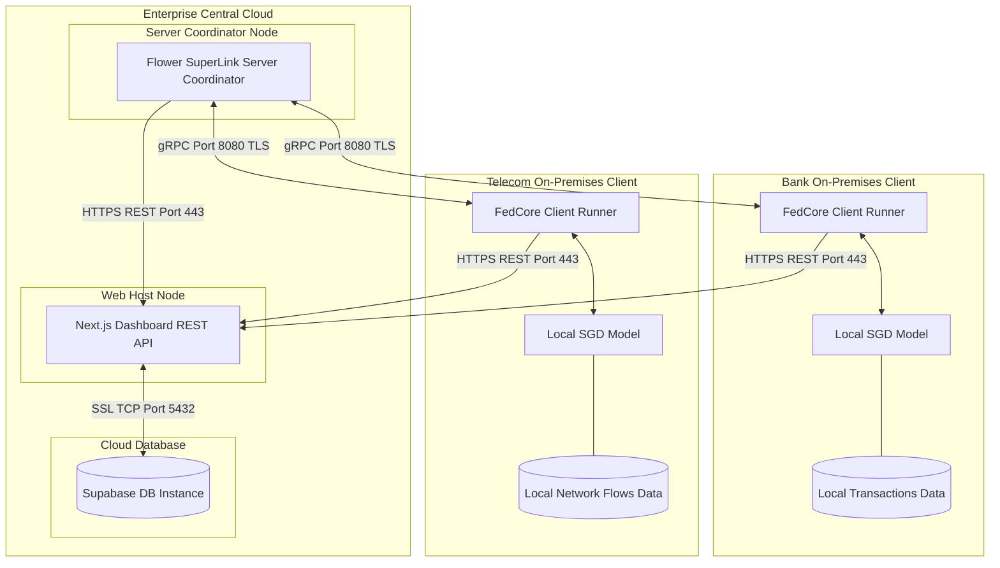
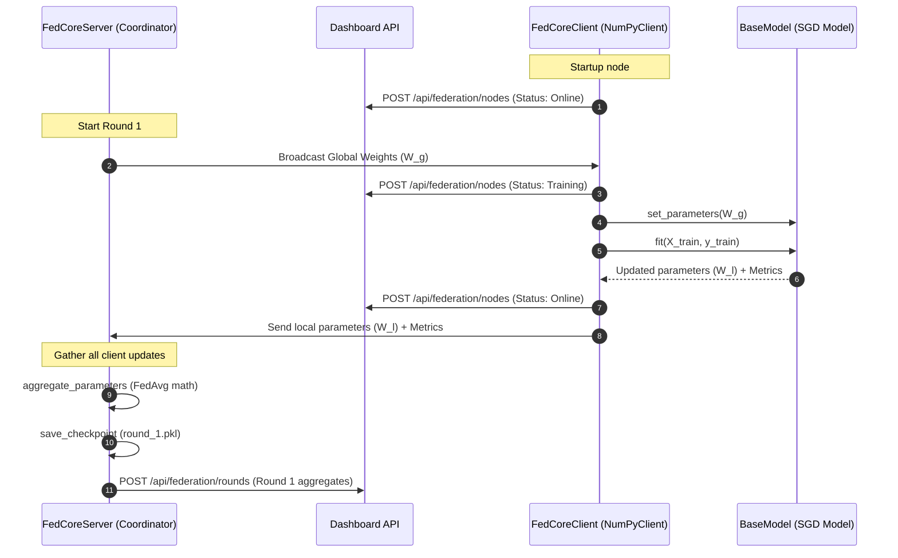
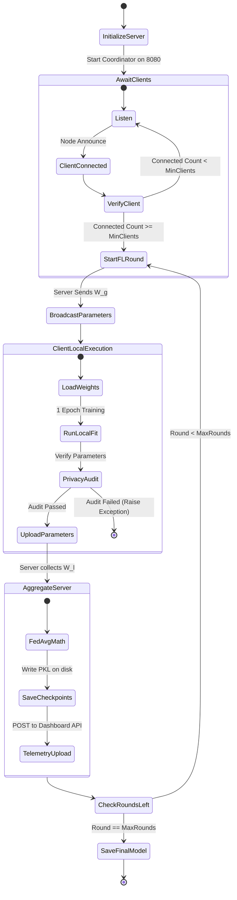

# UML & System Diagrams Reference

This document serves as the master UML architectural reference for the CyberFed AI platform. It contains comprehensive visual diagrams detailing the class structure, physical topology, component modularity, round execution lifecycle, and sequence transactions.

---

## 1. Class Diagram
Illustrates the object-oriented structure of the platform, the decoupling abstractions, and inheritance hierarchies.

---

## 2. Component Diagram
Illustrates the modular package structure of the platform, showing dependencies between packages and subsystems.

---

## 3. Deployment Diagram
Illustrates the physical nodes of the system and the networking protocols deployed between them.

---

## 4. Sequence Diagram
Illustrates the temporal transaction timeline of a complete federated training round.

---

## 5. Activity Diagram
Illustrates the logical workflow and decision-making logic of the federated optimization cycle.

